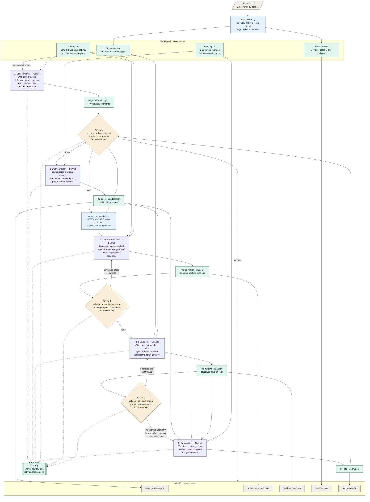

# TL;DR for assignment 3, Building an agent crew *Mr. Moonlight*

**Input--------------------**

**SCRIPT.txt** at the root — Is a script for the first level of the game (the vertical slice) its in a format that describes events, animations, items, etc, in a prose way that a writer is familiar with

**Context--------------------**
**knowledge/** — the briefing documents. What the crew needs to know about the game. these files were build from the project context (the GDD): canon.json (setting, art direction, enemy archetypes, hard rules) and budget.json (your critical-feature list with day estimates). These are subject to change with the GDD but for now they just provide enough context


**Outputs--------------------**


**blackboard/** — the whiteboard the team writes on. Created fresh every run. Each agent writes its result here and the next one reads it. Nothing is annotated or prettied up — it's exactly what each agent produced, plus run.log, the full transcript. 

**output/** — the finished deliverables. The same information, cleaned up, labelled, and ready to use. This is what you open, what goes into Unity, and what you read.


**How to run:--------------------**
python3 crew.py --dry-run     # free, no backend
python3 crew.py --scenes 2    # cheap real test
python3 crew.py               # full run

# Day 1 Slice Compiler — an agent crew for *Mr. Moonlight*

**Game:** *Mr. Moonlight* — a first-person survival horror game set on a remote Alaskan island in 1978. You play Tracey, an addict trying to reach her friends before a cult sacrifices them at the end of the week. Each night the island reshapes itself and she must find shelter before 3 a.m. Low poly, PS1-era art direction. Unity 6.3 LTS, solo developer.

**Capstone target:** the Day 1 vertical slice, releasing on itch.io.

## What this crew does

It reads the Day 1 script and produces the production data needed to actually build the level — plus a report of everything the script requires that the game design document never budgeted for.

```bash
python3 crew.py --dry-run    # full pipeline, no API key, no cost
python3 crew.py              # live run
```

The input is `SCRIPT.txt`: 224 numbered events across 10 scenes, in the format

```
EVT-030 | ANIMATION | Tracey wipes her mouth; her hand briefly passes in front of the camera.
```

The output is four files in `output/`:

| File | What it is |
|---|---|
| `asset_manifest.json` | Every unique asset Day 1 needs, each tagged `budgeted`, `partial` or `unbudgeted` against the GDD's own feature list |
| `animation_assets.json` | Every animation clip on its own, with rig target, capture method, whether it blocks player control, whether it needs an animation event, and grouped into mocap capture sessions |
| `runtime_data.json` | The objective state machine and the system-unlock timeline, with the asset IDs each objective depends on |
| `subtitles.json` | 77 dialogue and thought rows with speaker and delivery, ready for a subtitle system |
| `gap_report.md` | Severity-ranked findings: what will hurt, and why |
| `event_labels.json` | The label index: every event ID paired with its short name |

## Why *Mr. Moonlight* needs this specifically

The Day 1 script is finished through scene 07 and still in outline for scenes 08 to 10. It is also the only fully structured document in the project — the GDD is prose, but the script is a strict, parseable event table. That makes it the right spine for automation, and it makes the crew's job transformation rather than invention, which is far more reliable than asking a model to imagine content.

The gap between the script and the GDD is the real problem this solves. The GDD's critical-feature list was written before the script was, so it budgets for things the script does not use and omits things the script requires. Finding that by hand means reading 224 events against a 15-item feature list and holding both in your head. On its first run this crew surfaced, among others:

- The budget scopes the **mineshaft as "exterior only"**, but scene 09 sends the player through a mine interior with an infirmary room.
- **`EVT-204` requires a stretcher escort mechanic** — dragging Scott out of the mine. No escort or carry mechanic appears anywhere in the feature list.
- **Three objective-graph bugs** found deterministically, not by a model: `EVT-172` is an `OBJECTIVE:END` with no matching `START`, and `EVT-087` and `EVT-125` are `UPDATE` events acting as `START`s. Shipped as-is, the objective panel would either show a stale label or nothing at all.

That third finding is the one I care about most, and it is why the architecture looks the way it does.

## Architecture



Full source in `architecture.mmd`.

## The agents

| # | Agent | Model | Reads | Writes |
|---|-------|-------|-------|--------|
| 1 | Scenographer | Sonnet | one scene of `00_events`, `canon` | `01_requirements` + `event_labels` |
| 2 | Quartermaster | Sonnet | `01_requirements`, `budget` | `02_asset_manifest` |
| 3 | Animation director | Sonnet | filtered animation assets, their events, `canon` | `03_animation_list` |
| 4 | Sequencer | Sonnet | `00_events`, `02_asset_manifest` | `04_runtime_data` |
| 5 | Gap auditor | Sonnet | `02_asset_manifest`, `03_animation_list`, `04_runtime_data`, `budget`, gate residuals | `05_gap_report` |

Agents never call each other. Every handoff goes through a JSON file on the blackboard, so the complete inter-agent conversation is on disk and readable after the run. The terminal transcript plus `blackboard/` is the full audit trail.

### Why no agent can be removed

- **Remove the Scenographer** and there are 224 English sentences and no structured requirements. Nothing downstream has anything to deduplicate or budget-check.
- **Remove the Quartermaster** and the Sequencer has no asset IDs to attach to objectives, the Animation director has no animation assets to enrich, and the Gap auditor has nothing to compare against the budget — which is the entire point of the crew.
- **Remove the Animation director** and `animation_assets.json` degrades to a raw filter of the manifest: clip names with no rig target, no capture method, no event frames and no capture grouping. That is a list you cannot schedule against.
- **Remove the Sequencer** and the output is documentation instead of runtime data. Nothing goes into the engine.
- **Remove the Gap auditor** and you have a manifest of 120 assets with no verdict, no severity, and no read on whether Day 1 is deliverable.

The Scenographer runs **one call per scene** rather than one call for the whole script. That is deliberate: 224 events in a single call produces a shallow pass that misses requirements in the later scenes, and a truncated response is a silent failure. Per-scene calls also mean scene 03's 44 events get the same attention as scene 07's 13.

### Where the model is deliberately not used

Three jobs in this pipeline are done by ordinary Python, not by agents:

1. **Parsing the script.** The format is strict, so splitting `EVT-030 | ANIMATION | ...` into records is a regex. `parse_script.py` calls no model at all.
2. **Extracting subtitles.** Pulling quoted text out of a `DIALOGUE:T` line is mechanical. It also flags the two lines that have no quoted text — `EVT-177` and `EVT-182`, both marked "Exact lines are TBD" — as `needs_writing`.
3. **Selecting which assets are animations.** `schemas.animation_assets()` filters the manifest for `kind == "animation"`. That is a filter, so it is a filter. The agent's job starts after the selection is made.
4. **Annotating ID lists.** Expanding `["EVT-030", "EVT-031"]` into `[{event_id, label}, ...]` is a dictionary lookup.
5. **All three validation gates.** Schema shape, animation coverage, and the objective-graph cross-check are exact in code and approximate in a model.

This is the part I would defend hardest. Every token a model spends counting pipe characters is a token it is not spending on judgment. The Gap auditor is explicitly told that schema validity is already verified, so its whole budget goes to the calls only a model can make: is this deliverable, what does the player experience if this ships, where is the developer wasting days.

### Every ID carries a label

Raw IDs are unreadable. `EVT-204` means nothing on its own, so every ID list in every output file is expanded into pairs:

```json
"event_ids": [
  { "event_id": "EVT-030", "label": "mouth wipe" },
  { "event_id": "EVT-031", "label": "vision clears" }
]
```

Single-value ID fields keep their type and gain a sibling, so nothing that already reads them breaks:

```json
"start_event": "EVT-192",
"start_event_label": "Scott located"
```

The labels come from the Scenographer, which emits one per event as a second output while it is already reading that scene closely — no extra model calls. Everything downstream is annotated by **dictionary lookup in Python**, which is the point: `EVT-204` reads as the same phrase in the asset manifest, the animation list and the gap report, because all three are annotated from one index. Asking three agents to each write their own labels would have produced three phrasings for the same event.

Any event the agent misses falls back to the first few words of the event's own text, so no ID is ever left bare. `event_labels.json` is written out as the full index.

The blackboard keeps **raw, unannotated** agent output. Annotation happens on the way to `output/`, so what a human reads is labelled and what a reviewer inspects is exactly what the agent produced.

### The three gates

**Gate 1 — schema shape.** Runs on all five artifacts. Required fields, types, enum membership, non-empty strings. Failure retries the responsible agent once with the exact errors appended.

**Gate 2 — animation coverage.** Compares the Animation director's clip list against the animation assets the filter handed it. Catches four distinct failure modes: an asset dropped, a clip invented from nothing, a clip citing a non-animation asset, and a clip left out of every capture session. Nothing may be lost between the manifest and the animation list, and nothing may appear that the manifest never contained.

**Gate 3 — objective graph.** Compares the Sequencer's objective graph against the parsed script. When discrepancies survive one retry, the pipeline does **not** abort — it forwards them to the Gap auditor as evidence.

That is the correct behaviour here, because the residual discrepancy is a bug in the script, not a failure by the agent. An orphaned `OBJECTIVE:END` cannot be fixed by re-prompting; it can only be reported. A pipeline that crashed there would be hiding the most useful thing it found.

## First run

```bash
python3 verify_setup.py    # confirms every file arrived intact
python3 crew.py --dry-run  # full pipeline on fixtures, free, no backend needed
```

`verify_setup.py` exists because the most common failure is a file transferring as 0 bytes, which otherwise surfaces as an unhelpful `json.load` error several stages into a run.

## Running it

The crew has two interchangeable backends. Both take the same prompts and return the same artifacts — the only difference is how the text reaches a model and who pays for it.

| Backend | Auth | Use when |
|---|---|---|
| `claude-code` (default) | Pro or Max subscription, via the Claude Code CLI | You already pay for a subscription and don't want API credits |
| `api` | `ANTHROPIC_API_KEY` with credits | You're running headless, in CI, or want exact token accounting |

```bash
# No backend needed at all. Runs all four stages and both gates against the
# real script using fixtures. Free.
python3 crew.py --dry-run

# Subscription backend. Requires Claude Code installed and signed in.
python3 crew.py --scenes 2        # cheap test: first 2 scenes
python3 crew.py                   # full run: all 10 scenes

# API backend.
export ANTHROPIC_API_KEY=sk-ant-...
python3 crew.py --backend api

# Pick whichever is available.
python3 crew.py --backend auto
```

Python 3.9+, standard library only, no dependencies.

`call_model()` is the single seam between the crew and a model — about thirty lines. Everything above it (four agent prompts, the blackboard, both gates, the parser) is backend-agnostic and untouched by the choice. That separation is the point: swapping billing models should not be able to change what the crew produces.

Two notes on the subscription backend. Claude Code's plain-text output carries no usage figures, so token counts in the log are estimated from character length and labelled as estimates; the API backend reports exact numbers. And `CLAUDE_ARGS` at the top of `crew.py` is deliberately minimal so it works across CLI versions — if your install supports flags you want, add them there.

## Files

```
crew.py             orchestrator, five agents, three gates, output rendering
verify_setup.py     checks the repo transferred intact before you run anything
parse_script.py     deterministic script parser and subtitle extractor
schemas.py          artifact schemas, schema gate, objective-graph gate
SCRIPT.txt          the Day 1 script, 224 events — the crew's only content input
knowledge/
  canon.json                GDD extract: setting, art direction, archetypes
  budget.json               GDD critical-feature list with complexity days
architecture.mmd    Mermaid source for the diagram above
sample_run_transcript.txt   a committed --dry-run log
blackboard/         written at runtime: every artifact plus run.log
output/             written at runtime: the six game-ready files
```

## Known limitations

- The Scenographer's inferences are only as good as the script. Scenes 08 to 10 are still `OUTLINE`, so their requirements are coarser than scenes 01 to 07.
- Gap auditor severity is a judgment call and will vary between runs. Treat `BLOCKER` as "look at this today", not as gospel.
- The crew produces data, not art. It tells you that a wolf model is needed and unbudgeted; it does not make one.
- Animation durations are the Animation director's estimates, not measurements. Treat them as sizing for a capture schedule, not as timings to build against.
- Capture-session grouping assumes one performer and one location per session. If your mocap setup differs, the grouping is a starting point rather than a plan.
- `budget.json` was transcribed by hand from the GDD's first draft. When the GDD is revised, this file has to be updated with it or the gap report goes stale.
