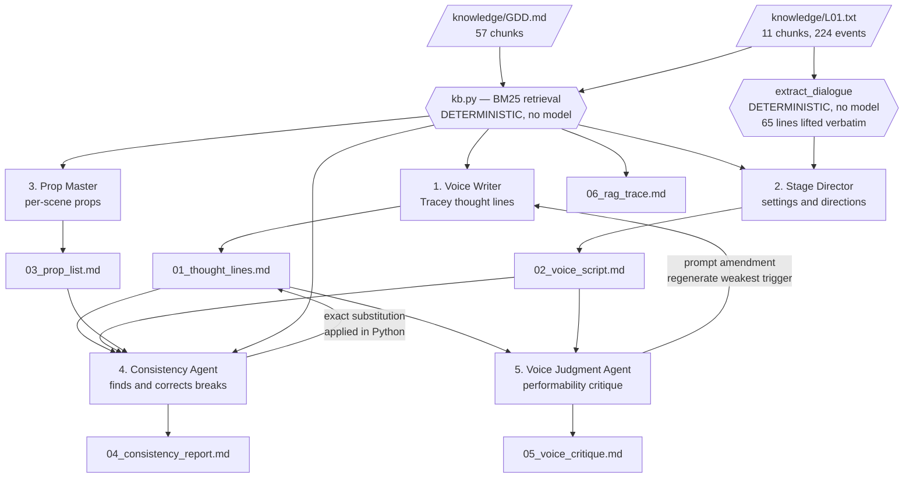

# Mr. Moonlight — Content Forge


TLDR instructions to run it:
```bash
python3 verify_setup.py          # confirms the files transferred intact
python3 kb.py                    # inspect the index and test retrieval, free
python3 forge.py --dry-run       # plumbing test on FIXTURES, free, not real content
python3 forge.py --quick         # live, 4 triggers and 3 scenes, cheap 
python3 forge.py                 # live, full run

python3 assemble.py              # IF LIVE RUNS FAIL USE THIS TO BUILD AGAIN THE OUTPUTS
```


A RAG pipeline that generates production content for **Mr. Moonlight** from the
game's own design document and Day 1 level script, then criticises and corrects
its own output.

**Game:** *Mr. Moonlight* — first-person survival horror, remote Alaskan island,
1978. You play Tracey, a functional addict trying to reach her friends before a
cult sacrifices them at the end of the week. Low poly, PS1 era. Unity 6.3 LTS,
solo developer.

## Knowledge base

The retrieval corpus is the project's own documents. Nothing else.

| Source | What it is | Chunks |
|---|---|---|
| `knowledge/GDD.md` | GDD v0.2, Vertical Slice, extracted from `GDD_v2.pdf` | 62 |
| `knowledge/L01.txt` | The Day 1 level script in SLDD format, 10 scenes | 11 |

73 chunks, roughly 1,710 characters each. The GDD is split on its own bold
section headings; the script is split one chunk per scene. No placeholder lore
appears anywhere in this pipeline.

## The three gaps this fills

The assignment asks what the game is thin on. These are real holes in the
project as it stands today, not invented ones.

### Gap 1 — Tracey is silent for most of Day 1

The GDD names muttering as the delivery mechanism for Tracey's characterisation:

> **Mental health** — Tracey is hostile and prefers to be alone, and she was not
> always like that. Day 1 shows it only through *what she mutters to herself*.

The script contains **11 `T:T` thought events** in the whole level, and Tracey is
alone from the moment she leaves the campsite until Vernon's cabin. The GDD's
stated mechanism for her character is running on eleven lines. The design pillars say "show, do not tell,"
but there is a difference between restraint and dead air, and the forest road,
the mine and the night escape currently have no player voice at all.

→ **`01_thought_lines.md`** generates **160 lines across 16 triggers**,
grounded in the GDD's characterisation of Tracey and the script's own events.

### Gap 2 — the dialogue is unreadable by a human performer

Every spoken line in the game lives inside a machine-parseable event line:

```
L01E-0580 || D:T || Line: My boots! My fucking boots! || Tone: N/A || Color: white || ...
```

That is correct for automation and unusable for a voice session. There is no
performable script, which means voice acting cannot begin.

→ **`02_voice_script.md`** extracts all **131 voiced lines across 8 scenes** into
theatre format with scene settings and performance directions. Five parts:
Tracey (74), Vernon (17), Rylee (16), Holly (14), Scott (10). Event IDs are
stripped — a performer has no use for `L01E-147`, and `06_rag_trace.md` carries
the traceability.

### Gap 3 — no per-scene prop breakdown exists

The GDD's critical-features list budgets sixteen environment assets for the whole
MVP. The script needs considerably more, and there is no scene-by-scene
breakdown, so modelling work cannot be scheduled or estimated.

→ **`03_prop_list.md`** proposes props per scene, each tagged `explicit` when the
source names it or `inferred` when the agent is proposing it, with a low poly
modelling note.

## Outputs

| File | Content |
|---|---|
| `01_thought_lines.md` | Tracey's inner monologue, 10 lines per trigger, 16 triggers |
| `02_voice_script.md` | Theatre-format recording script, all voiced dialogue |
| `03_prop_list.md` | Per-scene 3D prop proposals with modelling notes |
| `04_consistency_report.md` | Consistency Agent findings, with applied corrections |
| `05_voice_critique.md` | Voice Judgment Agent critique and the tweak it forced |
| `06_rag_trace.md` | Every query, its retrieved chunks, and the output produced |

## Architecture



## Retrieval: why BM25 and not embeddings

This uses **BM25 sparse retrieval**, implemented in `kb.py` in about sixty lines
of standard library Python. That is a decision, and it has a cost worth stating.

Reasons for:

1. Anthropic does not serve an embeddings endpoint, so a dense pipeline needs a
   second vendor and a second API key. This runs on one credential.
2. BM25 is **deterministic**. The same query returns the same chunks every run,
   which is what makes `06_rag_trace.md` a reproducible audit rather than a
   snapshot of one lucky retrieval.
3. The corpus is two documents totalling 97 KB with a shared, highly specific
   vocabulary — Tracey, Rylee, Furman, Aanniarvik, the Glade. Lexical overlap is
   a strong signal here. Dense retrieval earns its complexity on large
   heterogeneous corpora, which this is not.

The cost: **BM25 matches words, not meaning.** A query for "fear" will not
retrieve a chunk that only says "dread". The pipeline compensates by building
queries from the script's own vocabulary, which is where its accuracy comes from.
If the corpus grows to cover seven levels and a full GDD, this is the first thing
that should be replaced.

Retrieval quality, spot-checked:

| Query | Top chunk | Score |
|---|---|---|
| `Tracey grumpy addict mutters herself mental health` | `GDD#025 — THEMES` | 28.18 |
| `art style low poly textures palette` | `GDD#023 — ART STYLE` | 24.63 |
| `enemy roster wolf furman cultist zealot spotter` | `GDD#033 — enemy table` | 20.90 |

## What is deliberately not done by a model

Three jobs here are ordinary Python, and that is the load-bearing design choice:

1. **Retrieval.** BM25 scoring is arithmetic.
2. **Dialogue extraction.** The 65 lines an actor will speak are lifted verbatim
   out of the script's `Line:` parameters and never pass through a model. A model
   that silently "improves" a line in a recording script is worse than useless —
   the actor records something the game does not contain. The Stage Director
   agent is explicitly forbidden from touching dialogue text; it writes only the
   settings and directions **around** it.
3. **Applying corrections.** When the Consistency Agent finds a break, the fix is
   applied by exact string substitution in Python, not by asking a model to
   rewrite the file. That is why the before/after diff in
   `04_consistency_report.md` is the literal change made, and not a claim.

## The consistency loop

The Consistency Agent receives the generated content **and** the retrieved
passages it was supposed to be grounded in, and must return, for every finding,
the exact offending text and a drop-in replacement. The pipeline then applies
each correction by substitution and records whether it landed.

It checks four categories: lore breaks against the GDD and script, period breaks
for 1978, tone drift away from Tracey's specific voice, and **cross-document
contradictions** — places where the project's own documents disagree with each
other. That last category exists because this project already has known
document drift, and a critic that only checks generated content against a
possibly-wrong source is checking the wrong thing.

Findings, categories, applied status and literal diffs are in
`04_consistency_report.md`.

## The voice tweak loop

The rubric asks for at least one concrete prompt or retrieval tweak. Rather than
describing one, the pipeline performs one:

1. The Voice Judgment Agent reviews the generated lines for speakability,
   subtitle fit, voice consistency, range and direction quality.
2. It must propose **one specific, actionable amendment** to the writer's prompt.
   Vague advice is explicitly rejected in its instructions — "be more authentic"
   is not acceptable, "at least two of the ten lines must contain no profanity
   and no joke" is.
3. It names the weakest trigger.
4. The pipeline appends the amendment to the Voice Writer's system prompt and
   regenerates that trigger.
5. `05_voice_critique.md` shows the amendment text, the ten lines before, and the
   ten lines after.

## Deterministic content checks

`schemas.py` validates generated lines with no model involved:

- exactly ten lines per trigger
- subtitle length, hard limit 90 characters
- a 30-term anachronism blocklist for 1978 — `trauma`, `boundaries`, `vibe`,
  `processing`, `google`, `podcast` and similar
- duplicate line detection within a trigger

## How this run was produced

`assemble.py` rendered the six files in `output/` using the pipeline's own code:
`kb.py` performed the retrieval, `forge.extract_dialogue` lifted the 131 voiced
lines, `schemas.py` validated every generated line, and `forge.py`'s renderers
produced the markdown. The generation step — which `forge.py` normally delegates
to Claude over the CLI or API — was performed by Claude directly, because the
Claude Code backend was failing on the development machine at submission time.
Provenance is stated at the top of `generated_payload.py`.

`python3 forge.py` regenerates all of it through the model transport once the
backend works. `python3 forge.py --test-backend` diagnoses the CLI.

## Running it

```bash
python3 verify_setup.py          # confirms the files transferred intact
python3 kb.py                    # inspect the index and test retrieval, free
python3 forge.py --dry-run       # plumbing test on FIXTURES, free, not real content
python3 forge.py --quick         # live, 4 triggers and 3 scenes, cheap
python3 forge.py                 # live, full run
```

**`--dry-run` produces fixture data, not content.** It exists to prove the
pipeline runs end to end without spending anything, and every file it writes
carries a warning banner saying so. Use `--quick` for the first real output.

Backends: `--backend claude-code` (default, uses a Pro/Max subscription through
the Claude Code CLI) or `--backend api` (uses `ANTHROPIC_API_KEY`).

Python 3.9+, standard library only, no dependencies.

## Known limitations

- BM25 is lexical. Semantically phrased queries that share no vocabulary with the
  source will retrieve poorly.
- Scenes 08, 09 and 10 are still marked `[OUTLINE]`, so their retrieved context
  is thinner and their props lean more inferred than explicit.
- `L01E-165` is used twice in the source script. Reported as a BLOCKER in the
  consistency report; the renderer works around it, but it needs fixing.
- The Consistency Agent can only correct what it can locate by exact string
  match. Anything it cannot find is reported as `applied: no` rather than
  silently dropped.
- Prop counts are proposals, not a budget. Cross-check against the GDD's
  critical-features list before committing modelling time.
